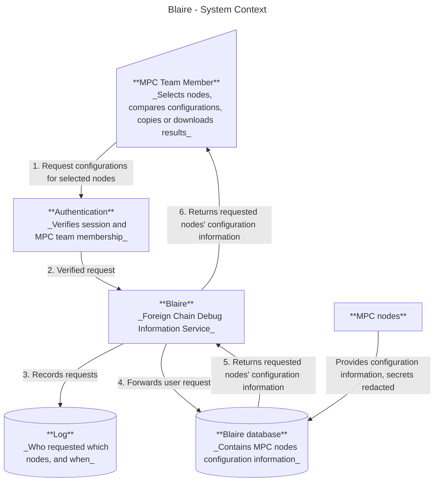

# Blaire - A debug information service for Foreign chain configurations

Status: Draft

## Purpose

This document defines goals and outlines the design of the Foreign chain configurations debug information webservice named Blaire. Blaire will enable the MPC team to easily inspect Foreign chain configuration information.

## Background

Nodes have Foreign chain RPC configurations which are not visible in debug endpoints due to them being potential attack vectors. We would still like to easily access and inspect this information to spot potential configuration bugs. 

## Proposed solution

Blaire will work as a standalone web application that serves Foreign chain RPC configuration debug information (e.g. foreign chain configuration, certain logs etc.) to authenticated users. Through Blaire, the MPC team members will save time and effort by simply requesting the webservice for information relevant to debugging.

## High level design

The webservice will be accessible to authenticated MPC team members. 

Work flow:
1. User authenticate themselves to access the webpage.
2. The user will be able to request the internal database for node configurations.
3. The database provides the user with this information in an accessible way.
4. (Potentially) The user will be able to save/copy/compare the information. 



The MPC nodes will provide most configurations, but secrets will still be redacted for security reasons. The nodes will publish these configurations to Blaire at their startup.

### Requirements

Required functions:
- Authentication of users
- Store MPC nodes' Foreign chain configurations
- Users able to request the database for configurations
- Users can see their own request history 

Potential functionalities:
- Download the information as a file/JSON
- The ability to easily copy the information to clip board (button)
- Hand-select several nodes of interest and get all of their configuration information at the same time
- Compare different nodes' configurations
- The MPC node operators having access to Blaire (means information will be more public)

## Wire formats/service API

(What methods should be implemented, unsure of what to add here)

Server endpoint/API root path: 
https://URL (TBD)

### MPC nodes <--> Blaire

POST /api/reports (adding a new config)
or
PUT /api/reports (modifying an already existing config)
Where the MPC nodes will send their configurations information at their startup.
(Unsure which of PUT/POST is the correct option here. Should there be a record of previous configs if a node operator is allowed to edit the config if PUT is allowed?)

```rust
async fn publish_node_config_report(
    State(state): State<AppState>,
    report: ForeignChainConfig
) -> Result<StatusCode,ApiError> {}
```

### Blaire <--> Users

PUT /api/login (log in authenticated users)
PUT /api/logout (log out authenticated users)
GET /api/nodes 
GET /api/nodes/{node_id}/config (get a node's config information)
GET /api/user/audit (access audit log for user)
GET /api/node?id={node_id}&id={node_id} (compare different node configs/showing them in the same place)

```rust
async fn get_node_configs(
    State(state): State<AppState>,
    node: Node,
    user: User,
) -> Result<Json<ForeignChainConfig>,ApiError> {}
```

```rust
async fn list_user_audit_log(
    State(state): State<AppState>,
    user: User,
) -> Result<Json<AuditEvent>,ApiError> {}
```


## Data model


### Structs

(Very much a work in progress...)
```rust
pub struct User {
    pub id: i64,
    pub username: String,
    pub password_hash: String,
}
```

```rust
pub struct Node {
    pub node_id: String,
    pub key_hash: String,
}
```

```rust
pub struct ForeignChainConfig {
    pub id: i64,
    pub node_id: String,
    pub config: String, //JSON?
}
```


### Database

The back-end will connect to a database containing some of the following tables. The foreign chain table will contain the configurations of the individual MPC nodes. There will also be a Node and operator mapping table, which connects which operator controls which node. Each node will also have an access key to Blaire, stored in a separate table. Another table will be an audit log, which will record all user events. The audit log is essential for visibility, error handling and security.
(Need to add more motivation of why each table is needed and how they connect with each other and the system)

#### Foreign chain configuration table

| Node ID       | Created at    | Foreign chain config |
| ------------- | ------------- | -------------        |
| Near #1       | date, time    | JSON(config)         |
| Everstake     | date, time    | JSON(config)         |
| ....          | date, time    | JSON(config)         |

```sql
CREATE TABLE node_config_reports (
    id INTEGER PRIMARY KEY AUTOINCREMENT,
    node_id TEXT NOT NULL UNIQUE,
    created_at TEXT NOT NULL DEFAULT (datetime('now')),
    fc_config TEXT NOT NULL
);
```

#### Node - operator mapping

| Node ID       | Operator ID   |
| ------------- | ------------- |
| Near #1       | .....         | 
| Everstake     | .....         |
| ....          | .....         |

```sql
CREATE TABLE node_operator_mapping (
    id INTEGER PRIMARY KEY AUTOINCREMENT,
    node_id TEXT NOT NULL UNIQUE,
    operator_id TEXT NOT NULL 
);
```

#### Audit log

| User ID       | Timestamp     | Event                 |
| ------------- | ------------- | -------------         |
| User #1       | date, time    | Logged in             |
| User #1       | date, time    | Request Node #1 config|
| ....          | date, time    | .....                 |

```sql
CREATE TABLE audit_log (
    id INTEGER PRIMARY KEY AUTOINCREMENT,  
    user_id TEXT NOT NULL,
    event_timestamp TEXT NOT NULL DEFAULT (datetime('now')),
    event_type TEXT NOT NULL
);
```

#### Node access key

| Node ID       | Access key (hashed)   |
| ------------- | -------------         |
| Near #1       | .......               |
| Everstake     | .......               |
| ....          | .......               |


```sql
CREATE TABLE node_access_keys (
    id INTEGER PRIMARY KEY AUTOINCREMENT,
    node_id TEXT NOT NULL UNIQUE,
    access_key TEXT NOT NULL
);
```

## Authentication/security

Initially, while in development, the webpage will have an authentications system where there will only be one single user, with a username and password configured in environment variables. Once the webpage is ready for deployment, there should be a stronger authentication system in place (details TBD).

### Risks

The configuration information used to be public but was withdrawn as an extra precaution. If the debug service were to be hacked and this information is leaked, we highten the risk to our node system. Therefore, security should still be strong and accessibility limited to only MPC team members. 